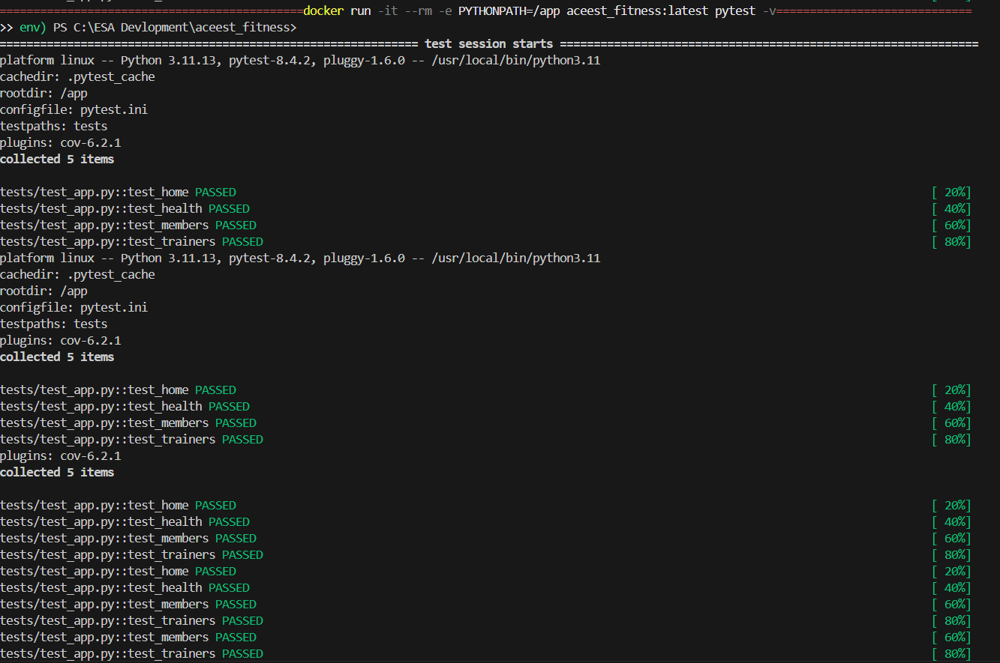
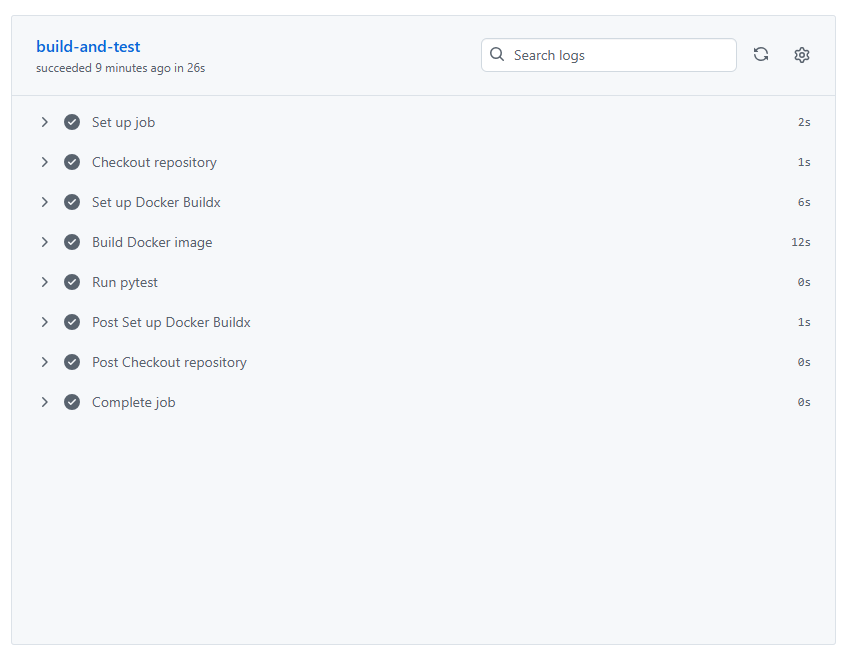
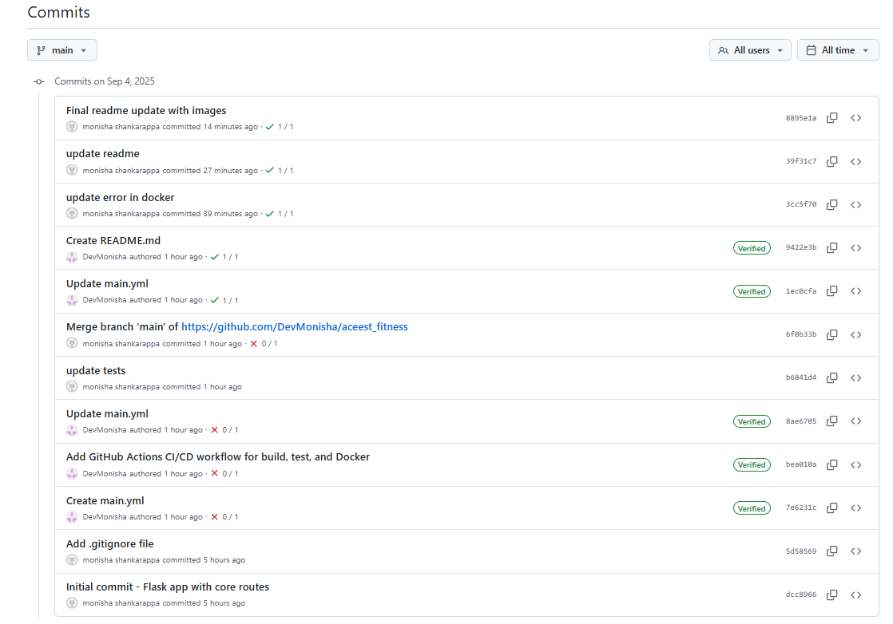

# ACEest Fitness and Gym

A Flask-based web application for managing a fitness and gym system.  
This project demonstrates core functionalities including member and trainer management, workout tracking, and API health monitoring. It is designed with DevOps practices in mind, including Docker containerization and CI/CD pipeline integration.

## Features

- **Home Page:** A welcome endpoint to confirm the application is running.
- **Members Management:** View a list of gym members with details like name, age, and membership type.
- **Trainers Management:** View a list of trainers and their specialties.
- **Workouts Management:** 
  - List all workouts.
  - Add new workouts with title and duration.
  - Delete existing workouts.
- **Health Check:** An endpoint to monitor the API status.
- **Unit Testing:** Pytest-based unit tests for core functionalities.
- **Dockerized:** Application packaged in a Docker container for consistent deployment.
- **CI/CD:** Automated build and testing pipeline using GitHub Actions.

## Prerequisites

Before running the application locally or in Docker, ensure you have the following installed:

- **Python 3.11** (or compatible)
- **pip** (Python package manager)
- **Docker** (for containerization)
- **Git** (for version control)
- **GitHub account** (for CI/CD integration)

Optional but recommended:

- **VS Code** or any IDE for Python development
- **Postman** or a browser for testing API endpoints

## Setup and Installation

### 1. Clone the Repository
```bash
git clone <your-github-repo-url>
cd aceest_fitness
```

### 2. Create and Activate Virtual Environment
#### Windows
```bash 
python -m venv .venv
.\.venv\Scripts\activate
```

#### macOS / Linux
```bash
python3 -m venv .venv
source .venv/bin/activate
``` 
### 3. Install Dependencies
```bash
pip install -r requirements.txt
```

### 4. Run the Flask Application Locally
```bash
python -m aceest_fitness.app
```

### 5. Run the Application in Docker

  #### Build Docker image
  ```bash
  docker build -t aceest_fitness:latest .
  ```

  #### Run Docker container
  ```bash
  docker run -p 5000:5000 -e PYTHONPATH=/app aceest_fitness:latest
  ```

## Running Tests

### 1. Running Tests Locally
Make sure your virtual environment is active:
```bash
# Activate virtual environment (Windows)
.venv\Scripts\activate

# Activate virtual environment (Linux/macOS)
source .venv/bin/activate

```

#### 1. Running Tests in Docker
```bash
docker run -it --rm -e PYTHONPATH=/app aceest_fitness:latest pytest -v
```



## CI/CD Pipeline Overview

The project includes a fully automated CI/CD pipeline that ensures code quality, runs tests, and builds Docker images on every push or pull request. The pipeline is configured using GitHub Actions and performs the following steps:

### Pipeline Steps

#### 1.Checkout Code

The pipeline first fetches the latest code from the repository.

#### 2. Set Up Python Environment

##### Installs the specified Python version (3.11) on the runner.

##### Sets up a virtual environment to isolate dependencies.

#### 3. Install Dependencies

##### Installs project dependencies listed in requirements.txt.

##### Ensures pip and Python packages are up to date.

#### 4. Run Tests

##### Executes all test cases using pytest.

##### Provides detailed test reports including passed/failed test counts.

##### Fails the pipeline if any test fails, preventing broken code from being merged.

#### 5. Build Docker Image (Optional: for deployment)

##### Builds a Docker image for the application using the Dockerfile.

##### Tags the image for local testing or deployment to a container registry.

#### 6. Continuous Feedback

##### Status of the pipeline is displayed in the pull request or commit history.

##### Developers are notified immediately if the build or tests fail, ensuring early detection of issues.



## successful runs for recent commits



## Key Features

### Automated Testing: Prevents broken changes from being merged.

### Dockerized Environment: Ensures consistent environments across development, testing, and production.

### Reproducible Builds: Each push triggers a fresh build, making deployments predictable.

### Easy Integration: Fully compatible with GitHub Actions, allowing seamless CI/CD integration.

           ┌───────────────┐
           │  Push/PR to   │
           │   GitHub      │
           └───────┬───────┘
                   │
                   ▼
           ┌───────────────┐
           │ Checkout Code │
           └───────┬───────┘
                   │
                   ▼
           ┌───────────────┐
           │ Setup Python  │
           │  Environment  │
           └───────┬───────┘
                   │
                   ▼
           ┌───────────────┐
           │ Install       │
           │ Dependencies  │
           └───────┬───────┘
                   │
                   ▼
           ┌───────────────┐
           │ Run Tests     │
           │ (pytest)      │
           └───────┬───────┘
                   │
       ┌───────────┴───────────┐
       │                       │
       ▼                       ▼
  Tests Passed               Tests Failed
       │                       │
       ▼                       ▼
┌───────────────┐       ┌───────────────┐
│ Build Docker  │       │ Fail Pipeline │
│ Image         │       │ & Notify Dev │
└───────┬───────┘       └───────────────┘
        │
        ▼
┌───────────────┐
│ Deploy / Push │
│ Docker Image  │
└───────────────┘


## Contributing

### Steps for other developers to contribute:

- **Fork repo**

- **Create a feature branch**

- **Run tests locally**

- **Submit PR**


## Technology Stack

- **Python 3.11**

- **Flask**

- **Docker**

- **pytest for testing**

- **CI/CD with GitHub Actions**

## License

- **State the license type (MIT, Apache, etc.)**